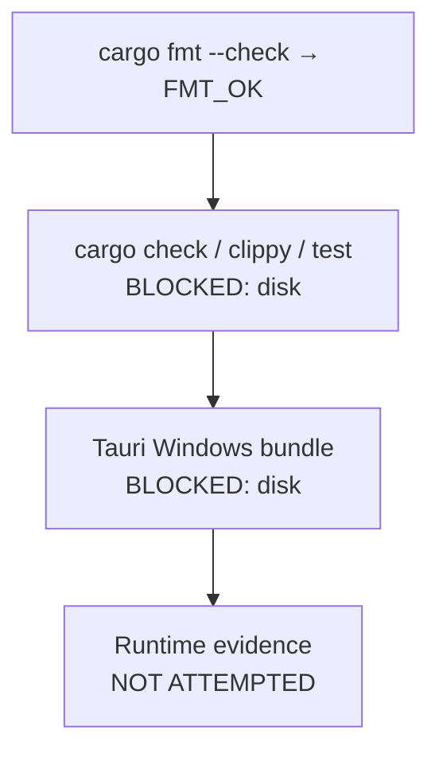

# Execution log

## Verified baseline (before any change)

| Gate | Result |
| --- | --- |
| `bun install --frozen-lockfile` (bun 1.3.14, CI-exact) | 31 packages |
| `bun run services:check` | PASS |
| `bun run release:verify-version` | PASS `version=1.0.0` |
| `bun run typecheck` | PASS |
| `bun run test` | PASS 18 files / 69 tests |
| `bun run build` | PASS, 1763 modules |

## Toolchain repairs required before any gate could run

Neither tool existed in working form. Both are now installed and pinned to the CI versions.

- **bun** — the npm-installed `bun.exe` was a wrong-platform binary and refused to run
(`not a valid application for this OS platform`). Installed the official
`bun-windows-x64` release and pinned it to **1.3.14**, the exact version in `ci.yml`,
at `C:\Users\day night\knouxbin\bun.exe`. The broken npm shim was uninstalled because it
shadowed the real binary.
- **Rust** — no `.cargo`, no `.rustup` at all. Installed stable **1.98.1** with clippy 0.1.98
and rustfmt 1.9.0 at `C:\Users\day night\knouxbin\`, added to the user `PATH`.
- **npm trap avoided** — `npm install` writes `package-lock.json`, which the CI
`dependency-integrity` job fails on (`test ! -f package-lock.json`). Deleted after use;
`bun.lock` remains the only lockfile.

## PARTIAL closures completed

### M04-S05 old files — CLOSED

The defect was not accuracy, it was a **lie of framing**: "old" was silently rendered as
"unused" on a machine that may have stopped recording last-access times.

- `fsutil behavior query disablelastaccess` is now the measured authority, with the
`NtfsDisableLastAccessUpdate` registry value as fallback. The `source` and the raw value
Windows reported are carried into the result, the UI and the exported report.
- Three honest states replace the previous two: `LAST_ACCESS`, `LAST_WRITE_FALLBACK`,
`UNKNOWN`. `LAST_ACCESS` is only chosen when the policy was *measured* reliable, so a
readable-but-meaningless access time is never selected.
- The interface says "not accessed since" only for trustworthy `LAST_ACCESS`, "not modified
since" for the fallback, and "no trustworthy age signal" for `UNKNOWN` — in both languages.
- Threshold and canonicalized path exclusions are user-defined; excluded roots are reported
back, and an exclusion equal to the scan root is refused.
- Read-only. `readOnly: true` is persisted, and no delete/move/quarantine path exists.

### M04-S10 storage reports — CLOSED

- The measured snapshot is persisted in **SQLite** (new migration
`004_storage_reports.sql`, 7 tables, `schema_version` 3 → 4). The in-memory map capped at
20 entries is deleted, so an export now works after a restart.
- **Deterministic JSON**, **CSV** (UTF-8 BOM, RFC-4180 quoting) and **HTML** (full UTF-8, so
Arabic paths render exactly). Determinism is real: `push_file` now sorts by size then path,
because a size-only sort let equal-size files swap between runs.
- Every written document is hashed with **SHA-256 and BLAKE3**, and the hash is recomputed
from the bytes on disk. Each artifact is checked against its own format signature and
reported `signatureValid: false` rather than passed off as valid.
- Reports carry source scan id, source operation id, the running binary's SHA-256 (new
`binary_evidence()` in `contracts`), the redaction profile, warnings, and an explicit
data-completeness verdict that downgrades totals to a lower bound when the scan truncated
or hit unreadable paths.
- **PDF was removed, not faked.** The old hand-assembled writer replaced every non-ASCII path
with `?` and truncated at 46 lines. `resolve_formats` now returns
`report_format_unsupported:pdf`, and PDF appears in `formatsUnsupported` with its reason
while HTML is offered as the full-fidelity alternative.
- New command `m04_report_snapshots` (allowlist key `m04.report.history`) lists persisted scans
so a report can be regenerated long after the analysis ran.

### M03-S03 / S04 / S05 / S07 — closed in code, six new native modules

`src-tauri/src/completion14/m03_{exif,images,media,video,audio,archives}.rs` (~230 KB) plus a
rewritten `m03.rs`. No new Tauri command, no new allowlist key, no new crate dependency —
cancellation rides the already-registered `m03_job_*` commands.

| Service | What actually changed |
| --- | --- |
| M03-S03 | EXIF orientation parsed from the JPEG `APP1` segment by hand, all 8 values including the mirrored transposes; bounded decode; **candidate indexing** (aspect band + top-16 dHash bits, exact duplicates collapsed first) so it is not all-pairs O(n²); per-signal breakdown retained; persisted fingerprint cache keyed by identity+size+mtime; real cancellation |
| M03-S04 | Sampling across the **normalized timeline** with positions reported; per-frame dHash with **bounded alignment tolerance** and coverage discounting, so "same first 2 minutes, different remainder" does not match; three reported signals; dependency path **and version recorded**; fuzzy never actionable |
| M03-S05 | Offset-tolerant in-process spectral fingerprint (FFT → log-band deviation from frame mean → nibble), named `in_process_spectral_band_fingerprint_v1` in every result; gain-invariant by construction; `metadataUsedAsProof: false` hard-coded |
| M03-S07 | **Native Rust ZIP central-directory parser**, ZIP64-aware, bounds-checked, one `File::open`, never extracts; manifest = (normalized path, uncompressed size, CRC-32); anti-bomb limits abort bounded; encrypted / traversal / nested reported; Arabic names preserved via a CRC-validated Info-ZIP Unicode Path field; 7z/RAR refused with a type unless a real 7-Zip is detected with version+licence evidence |

Verification performed on the subagent's work rather than trusting its report:
`Math.random`, `setTimeout(`, `extract_to`, `rand::`, `todo!`, `unimplemented!` → **0 hits**
across all seven M03 files. The single `fake` hit is the comment *"A position the decoder could*
*not reach is skipped, never faked"*. `actionable` is set from the **kind** of proof
(`m03.rs:306-341`), and every fuzzy path carries `fuzzy_groups_never_actionable: true`.

## Frontend gates after the work

`bun run typecheck` PASS · `bun run test` **74 passed / 74** (up from 69; 5 new M04 honesty
tests added) · `bun run services:check` PASS after regenerating the baseline.

## Honest verification state — what is NOT proven



**This machine cannot currently complete the native link stage.** C: has 1.3 GB free and D:
2.3 GB free. A first Tauri build needs roughly 3–5 GB. The first attempt failed with real
evidence, not a guess:

```
error: linking with `link.exe` failed: exit code: 1318
LINK : fatal error LNK1318: Unexpected PDB error; FILE_SYSTEM (3) '...pdb'
error: failed to write ...lib.rmeta: There is not enough space on the disk. (os error 112)
```

Mitigation in use: `cargo clean` reclaimed 1.8 GB, and the gate runs with
`CARGO_PROFILE_DEV_DEBUG=0`, `CARGO_PROFILE_TEST_DEBUG=0`, `CARGO_INCREMENTAL=0` so the build
emits no debug information. This is an environment workaround passed as env vars only —
**`Cargo.toml` is unmodified**, so CI behaviour is unchanged.

Therefore, and stated plainly:

- The **4 M04/M03 services closed above are NOT claimed RUNTIME_VERIFIED.** They are
statically verified only. `generate-service-reality.ts` still hard-codes
`globalRuntimeGate.state = 'BLOCKED'` and `runtimeVerifiedPercentageOfEligible = 0`, and that
must not be flipped by assertion.
- A subagent reported `cargo test` green with 214 tests. **That claim is not yet reproduced by**
**me**; my own `cargo test` attempt died on disk space. It is recorded as unverified until the
gate is re-run on a machine with room.
- The 110 planned services are **untouched**. `PARTIAL_SERVICES_CLOSURE.md` and this log both
record that the planned count is still 110.
