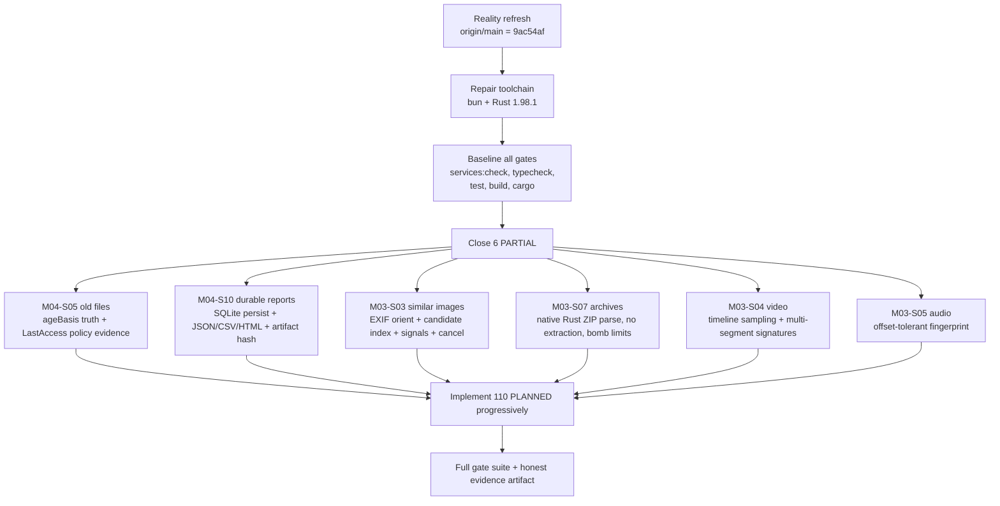

# Reality refresh — 2026-09-25

## Repository state, verified not assumed

| Check | Result |
| --- | --- |
| `D:\Knoux Projects\Knoux_Project_Center\01_Ready\KNOUX-ONE` | Was **not** a git repository (no `.git`) |
| Canonical remote | `https://github.com/daynightae-cmyk/KNOUX-ONE.git`, reachable |
| `origin/main` (live, `git ls-remote`) | `9ac54af896d248d1d948f83d52920bf890cf9866` — **matches** the value given in the brief |
| Remote branch count | 16 branches; main is the merge of PR #15 (`feat/knoux-one-unified-workspace-shell-20260925`) |
| Local worktree vs `origin/main` | **Byte-identical.** `git read-tree origin/main` + `git diff --stat origin/main` returned zero differences across all 245 tracked files. |

Actions taken, none destructive:

1. `git init -b main` in the project root (the directory was an un-versioned copy of `main`).
2. `git remote add origin <canonical>`; `git fetch origin --prune` — 16 branches fetched.
3. Anchored `refs/heads/main` to `9ac54af` via `git update-ref` + `git symbolic-ref`, then `git reset --mixed HEAD`. The working tree was never checked out over or overwritten.

**Conclusion: there is no local-only completed work to preserve. The working tree is exactly `origin/main`.** Nothing was discarded.

## Untracked research pack (ingested as implementation authority)

7 untracked files, all outside the git tree:

| File | Size | Role |
| --- | --- | --- |
| `PARTIAL_SERVICES_CLOSURE.md` | 8.1 KB | Target + implementation + test + runtime-proof spec for the 6 PARTIAL services |
| `PLANNED_SERVICES_BUILD_MAP.md` | 10.5 KB | 110 planned services, readiness, phase, primary source/interface |
| `REAL_IMPLEMENTATION_MATRIX.md` | 7.5 KB | Per-service handler/native-command/safety evidence |
| `knoux-production-schema.sql` | 7.1 KB | Target 22-table production schema (**not yet applied** — see below) |
| `services.json` | 1002 KB | Master service data |
| `MASTER_SERVICE_TABLE.csv` | 159 KB | Master service table |
| `KNOUX_ONE_PRODUCTION_RESEARCH_PACK.zip`, `KNOUX-ONE.zip` | 467 KB / 3.4 MB | Packaged copies |

The 6 PARTIAL services, from `src/data/serviceVerification.ts` (the only export of that file):

| Service | Gap that makes it partial |
| --- | --- |
| `m03_s03` similar images | O(n²) all-pairs, no EXIF orientation normalize, no candidate index, `can_pause/can_cancel=false` in completion path |
| `m03_s04` duplicate video | ffprobe from PATH, only first 120 s at 1 frame/10 s, 32×32 grayscale |
| `m03_s05` duplicate audio | first 300 s → mono 8 kHz → ~1 s RMS-energy bins only |
| `m03_s07` duplicate archive | manifest compare, 7z/RAR depend on external 7-Zip listing |
| `m04_s05` old files | LastAccess unreliable; `last_access` vs `modified_fallback` basis exists but system LastAccess **policy is never detected** |
| `m04_s10` storage report export | in-memory snapshot map capped at 20 (lost on restart); hand-rolled ASCII-only PDF capped at 46 lines |

## Toolchain gaps found and being repaired

| Tool | Found | Action |
| --- | --- | --- |
| `bun` | **Broken** — `bun.exe` is a wrong-platform binary ("not a valid application for this OS platform") | installing official `bun-windows-x64.zip` release |
| `cargo` / `rustc` / `clippy` / `rustfmt` | **Absent entirely** — no `.cargo`, no `.rustup` | installing via `rustup-init.exe`, stable 1.98.1 |
| `node` | v26.9.0 | ok |
| `node_modules` | absent | `npm install` |

Two traps recorded so they are not re-introduced:

- `npm install` writes `package-lock.json`, which **breaks** the CI `dependency-integrity` job that asserts `test ! -f package-lock.json`. The lockfile must be removed after install; `bun.lock` is the only canonical lockfile.
- CI gate order (`ci.yml`): `bun install --frozen-lockfile` → `services:check` → `release:verify-version` → `typecheck` → `test` → `build`; then on Windows `cargo fmt --check` → `cargo check --locked --all-targets --all-features` → `cargo clippy --locked --all-targets --all-features -- -D warnings` → `cargo test --locked --all-features` → Tauri debug NSIS bundle.

## Architecture invariants that constrain all new work

These are enforced by tests, so new code must satisfy them or the tests must be updated honestly.

1. **No arbitrary execution.** Exactly one `invoke(` exists in `src/**`, in `src/services/nativeClient.ts`. No `@tauri-apps/plugin-shell`, no `eval`, no `new Function`. `antiCheating.test.ts` also forbids `handlerId.replace`.
2. **The allowlist is literal.** `src/services/nativeCommandRegistry.ts` maps `handlerId` → exact Tauri command name via `hasOwnProperty`. `main.rs` registers the commands in `tauri::generate_handler!`. `capabilities/default.json` grants only `core:default`, `updater:default`, `process:allow-restart`.
3. **Planned services must not be executable.** `catalogIntegrity.test.ts` requires `planned ⇒ handlerId === undefined && status === 'planned'`; `implemented ⇒ handlerId` is a key of `NATIVE_COMMANDS`.
4. **Hard-coded totals.** `catalogIntegrity.test.ts` asserts 19 modules / 190 services / 80 implemented / 0 partial / 110 planned. `shellIntegrity.test.ts` asserts presentations 74 implemented / 6 partial / 110 planned. `generate-service-reality.ts` throws unless there are exactly 190 services. These numbers **must move together** as work lands, and the committed `docs/services/service-reality-baseline.{json,md}` must be regenerated by `services:generate` or `services:check` fails.
5. **Module 16 is pinned to planned** by an explicit test.
6. **No fabricated progress.** `antiCheating.test.ts` forbids `Math.random` and `setTimeout(` in the network native module and workspace, and `setTimeout` in `duplicateStore.ts`. A polling timer may only request a fresh native measurement.

## Executed plan

A PARTIAL service leaves `PARTIAL_SERVICE_IDS` only when its closure spec is genuinely met, and the honest consequence is that the presentation counts move: `partial` 6 → 0 and `implemented` 74 → 80.

## Honesty policy

`RUNTIME_VERIFIED` requires recorded Windows runtime evidence. Static trace, a passing typecheck, or a passing build is **not** runtime proof. `generate-service-reality.ts` currently hard-codes `globalRuntimeGate.state = 'BLOCKED'` and `runtimeVerifiedPercentageOfEligible = 0`; that stays BLOCKED until an actual Windows run of the built app produces evidence, and it is not to be flipped by assertion.
